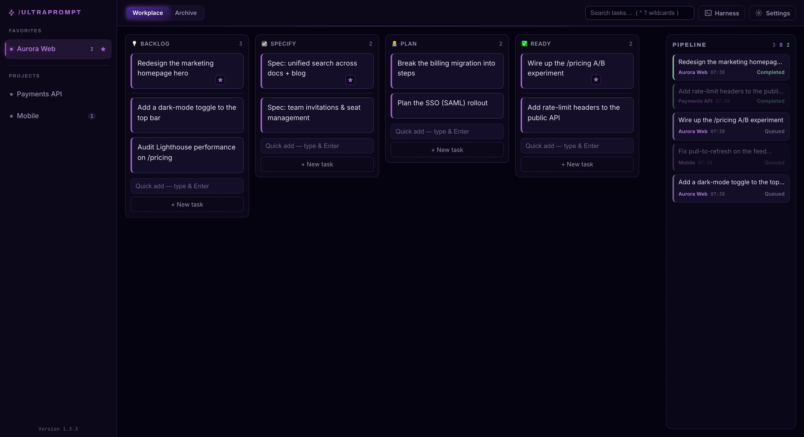
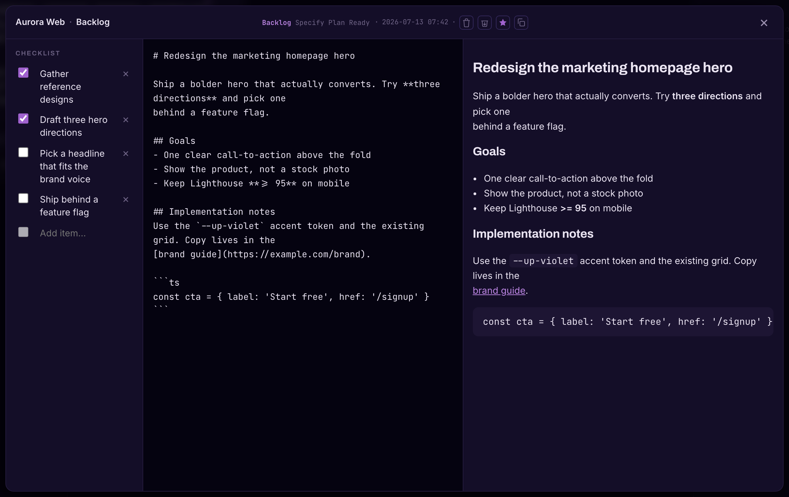
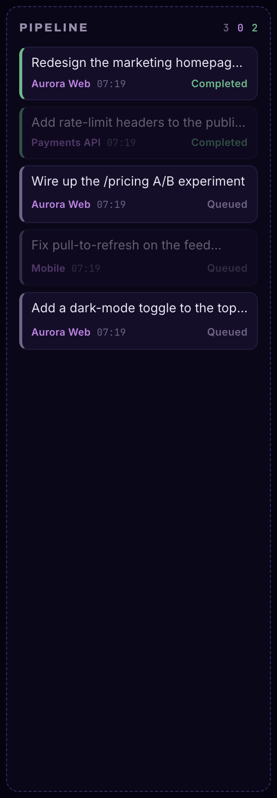

# Ultraprompt

**A kanban board that pipelines tasks to your AI coding agent.**

[](https://github.com/petarbeck/ultraprompt/releases/latest)
[](https://github.com/petarbeck/ultraprompt/actions/workflows/release.yml)
[](LICENSE)

Ultraprompt is a desktop app for preparing per-project tasks on a kanban board and
**pipelining** them — as markdown — into each project's working directory for its AI
harness (e.g. [Claude Code](https://claude.com/claude-code)). Drop a task onto the
pipeline and it's handed off to the agent, then tracked through **Queued → Processing →
Completed** as the queue drains.



## Download

Get the latest build from the **[Releases page →](https://github.com/petarbeck/ultraprompt/releases/latest)** — macOS is signed + notarized (opens with no Gatekeeper prompt):

| Platform | File to grab |
|---|---|
| **macOS** (Apple Silicon + Intel) | `Ultraprompt_*_universal.dmg` — open it, drag Ultraprompt to Applications |
| **Windows** | `Ultraprompt_*_x64-setup.exe` (installer) or `Ultraprompt_*_x64_en-US.msi` |
| **Linux** — Debian/Ubuntu | `Ultraprompt_*_amd64.deb` |
| **Linux** — Fedora/RHEL | `Ultraprompt-*.x86_64.rpm` |
| **Linux** — portable | `Ultraprompt_*_amd64.AppImage` (`chmod +x`, then run) |

Prefer to build it yourself? See [Install & run from source](#install--run-from-source).

## Why

Coding agents work best from a clear, self-contained task spec. Ultraprompt is where you
write and organize those specs — one board per set of projects, lanes for your workflow
(Backlog → Specify → Plan → Ready) — and then hand the finished task to the agent with a
single drag. It watches the agent's queue folder and shows you live progress, so you can
prep the next task while the current one runs.

## Features

- **Per-project kanban board** with global, reorderable lanes (Backlog / Specify / Plan / Ready).
- **Pipeline to your AI harness** — drop a task on the **Pipeline** panel and its markdown
  body is written to `<project>/.ultraprompt/queue/`, then tracked **Queued → Processing →
  Completed** as the agent drains the queue. Tasks from other projects are dimmed so the
  active project's work stands out.
- **`/ultraprompt` slash command** — one paste sets up a project [Claude Code](https://claude.com/claude-code)
  command that arms the harness; after that you just type `/ultraprompt` to run it.
- **Rich task modal** — a markdown editor with live preview and an in-app checklist for prep
  (the checklist is never exported).
- **Favorites, live search** (`*`/`?` wildcards), **archive**, **undo** on destructive actions,
  and pointer-based drag that works identically across platforms.

<p align="center">
  
  
</p>

## Install & run from source

**Prerequisites**

- **macOS / Windows / Linux** (see [Platforms](#platforms))
- **[Node.js](https://nodejs.org) 22.x** and npm
- **[Rust](https://rustup.rs)** (stable; native toolchain recommended — on Apple Silicon,
  `aarch64-apple-darwin`) — see [Tauri prerequisites](https://tauri.app/start/prerequisites/)
- Platform build tools: **Xcode Command Line Tools** (macOS), **MSVC + WebView2** (Windows),
  or the **webkit2gtk** dev packages (Linux)

**Run it**

```sh
git clone https://github.com/petarbeck/ultraprompt.git ultraprompt && cd ultraprompt
npm install
npm run tauri dev      # launches the native app window
```

**Build a distributable bundle**

```sh
npm run tauri build    # -> src-tauri/target/release/bundle/
```

On macOS this produces `Ultraprompt.app` (and a `.dmg`). Double-click the `.app` in Finder to
run it. An unsigned build triggers Gatekeeper the first time — right-click the app → **Open**,
or sign/notarize it with your Apple Developer ID for a clean launch.

## Platforms

Ultraprompt is built on **[Tauri 2](https://tauri.app)** (Rust core + web UI), which targets
macOS, Windows, and Linux from the same codebase — the drag interactions are pointer-based, so
they behave identically across WebKit / WebView2.

A bundle is **platform-specific**, though: a macOS `.app` won't run on Windows or Linux. To
distribute for all three, build on each OS (or wire up a CI matrix, e.g. GitHub Actions with
[`tauri-action`](https://github.com/tauri-apps/tauri-action), which builds and attaches
per-platform artifacts to a release). The repo itself runs on any of the three — just build
there.

## Data & schema upgrades

Your data is a **local SQLite database** — no account, no server. It lives in the OS app-data
directory (`~/Library/Application Support/at.ultraprompt/ultraprompt.db` on macOS).

The schema is created and upgraded by **incremental, append-only migrations** (tauri-plugin-sql,
in `src-tauri/src/lib.rs`). Each migration has a version; on launch the app applies any whose
version is newer than what's already recorded, so **dropping a new version over an old one just
runs the pending migrations — your data is preserved.** (Migrations are append-only: a shipped
migration is never edited, since the plugin checksums applied ones.)

## Development

```sh
npm test                                          # Vitest (front-end unit tests)
npx vue-tsc --noEmit && npm run build             # typecheck + web build
cargo test --manifest-path src-tauri/Cargo.toml   # Rust tests
```

Stack: Tauri 2 (Rust) · Vue 3 `<script setup>` + TypeScript · Pinia · Vite · SQLite
(`@tauri-apps/plugin-sql`).

## License

[MIT](LICENSE) © Petar Beck
